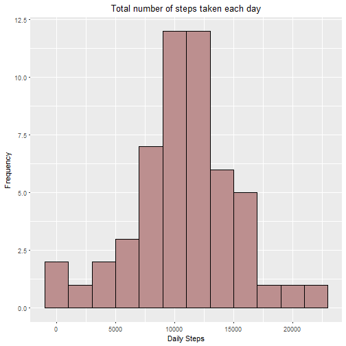
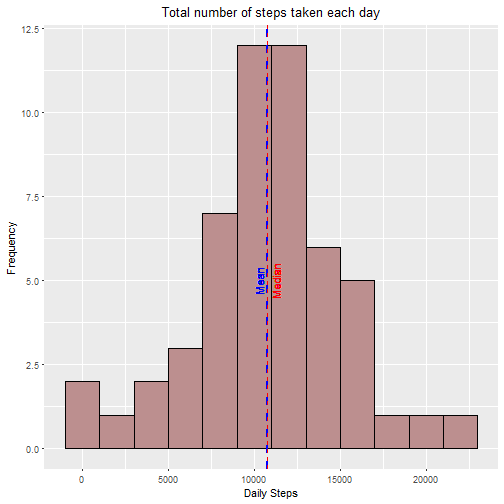
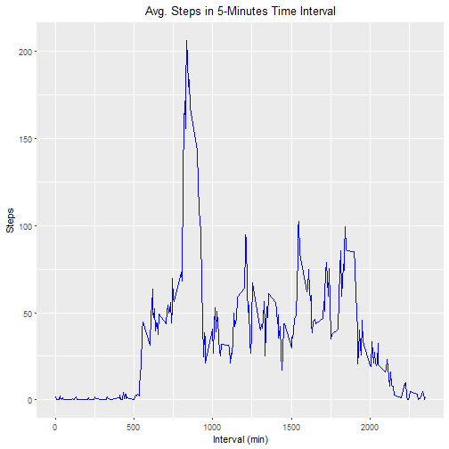
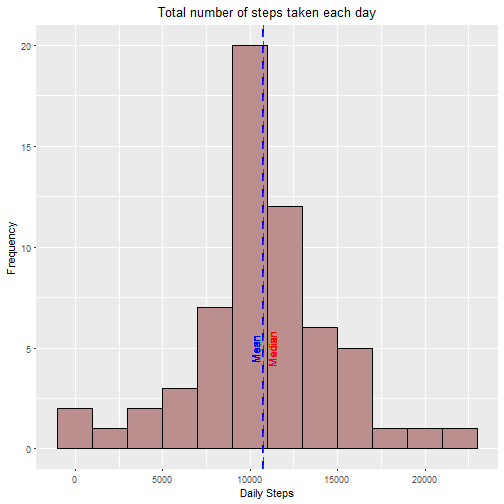
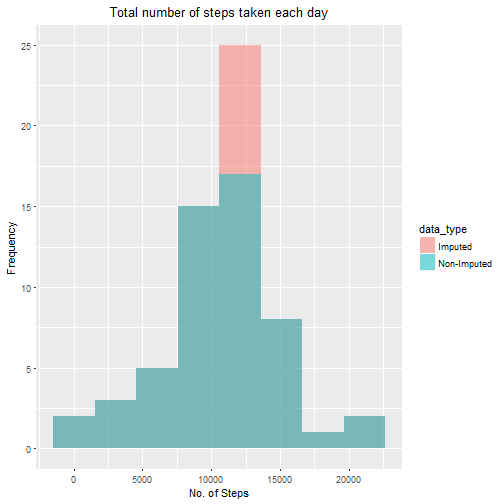
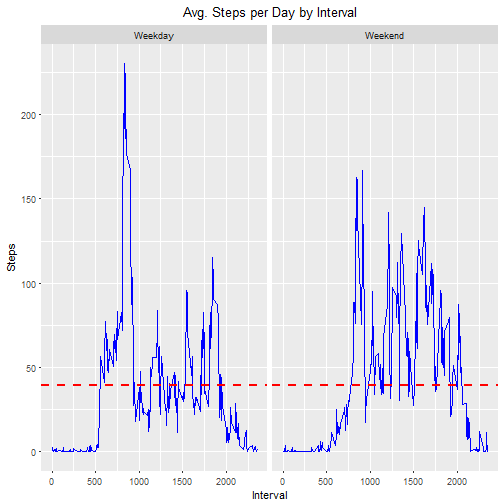

```r
title: "Reproducible Research: Peer Assessment 1"
```

```
## Warning: NAs introduced by coercion
```

```
## Error in title:"Reproducible Research: Peer Assessment 1": NA/NaN argument
```

```r
output: 
  html_document:
    keep_md: true
```

```
## Error in eval(expr, envir, enclos): object 'output' not found
```


```r
options(knitr.table.format = "html")
```

### Loading libraries

```r
library(knitr)
library(kableExtra)
library(dplyr)
library(ggplot2)
library(lubridate)
library(tidyverse)
library(stringr)
```


### Loading and preprocessing the data


```r
filename <- "data.zip" 

###### Download and unzip the dataset:
if (!file.exists(filename)){
  fileURL <- "https://d396qusza40orc.cloudfront.net/repdata%2Fdata%2Factivity.zip"
  download.file(fileURL, filename)
}  
if (!file.exists("activity")) { 
  unzip(filename) 
}

######### Load data

activity <- read.csv("activity.csv")
str(activity)
```

```
## 'data.frame':	17568 obs. of  3 variables:
##  $ steps   : int  NA NA NA NA NA NA NA NA NA NA ...
##  $ date    : Factor w/ 61 levels "2012-10-01","2012-10-02",..: 1 1 1 1 1 1 1 1 1 1 ...
##  $ interval: int  0 5 10 15 20 25 30 35 40 45 ...
```

```r
#Convert date from Factor to Date 
activity$date <-ymd(activity$date)
```

### What is mean total number of steps taken per day?
1.Histogram of the total number of steps taken each day

```r
total_steps<- activity %>%
        drop_na(steps)%>%
        select(date, steps)%>%
        group_by(date)%>%
        summarise(total_steps = sum(steps, na.rm = TRUE))

sum(total_steps$total_steps)
```

```
## [1] 570608
```
* The **total number of steps** taken per day is __570608__


```r
ggplot(total_steps, aes(x = total_steps))+
           geom_histogram(col = "black", fill = "rosybrown", binwidth = 2000) +
           xlab("Daily Steps") +
           ylab("Frequency")+
           theme(plot.title = element_text(hjust = 0.5))+
           ggtitle("Total number of steps taken each day")
```



  
 2.Calculate and report the mean and median total number of steps taken per day

```r
mean_steps <- round(mean(total_steps$total_steps), digits = 2)
median_steps <- round(median(total_steps$total_steps), digits =2)

# build result dataframe
df <- data.frame(c("Mean", "Median","Total"),c(as.numeric(mean_steps),as.numeric(median_steps), sum(total_steps$total_steps)))
colnames(df) <- c("Metric","Value")

# print table with results
df %>%
        kable(booktabs = TRUE, caption = "Table 1. Median and Mean Daily Steps") %>%
        kable_styling(full_width = F, position = "left", bootstrap_options = c("hover", "responsive")) %>%
        column_spec(column = 1:2  ,width = "9em" )
```

<table class="table table-hover table-responsive" style="width: auto !important; ">
<caption>Table 1. Median and Mean Daily Steps</caption>
 <thead>
  <tr>
   <th style="text-align:left;"> Metric </th>
   <th style="text-align:right;"> Value </th>
  </tr>
 </thead>
<tbody>
  <tr>
   <td style="text-align:left;width: 9em; "> Mean </td>
   <td style="text-align:right;width: 9em; "> 10766.19 </td>
  </tr>
  <tr>
   <td style="text-align:left;width: 9em; "> Median </td>
   <td style="text-align:right;width: 9em; "> 10765.00 </td>
  </tr>
  <tr>
   <td style="text-align:left;width: 9em; "> Total </td>
   <td style="text-align:right;width: 9em; "> 570608.00 </td>
  </tr>
</tbody>
</table>
Mean and Median over the histogram

```r
ggplot(total_steps, aes(x = total_steps))+
        geom_histogram(col = "black", fill = "rosybrown", binwidth = 2000) +
        geom_vline(aes(xintercept = mean(total_steps)), linetype = "dashed", size = 1, col = "blue")+
        geom_text(aes(x = mean(total_steps)-500, label ="Mean", y = 5), angle = 90, col = "blue")+
        geom_vline(aes(xintercept = median(total_steps)), linetype = "dashed", size = 0.2, col = "red" )+
        geom_text(aes(x = median(total_steps)+500, label ="Median", y = 5), angle = 90, col ="red")+
        xlab("Daily Steps") +
        ylab("Frequency")+
        theme(plot.title = element_text(hjust = 0.5))+
        ggtitle("Total number of steps taken each day")
```




### What is the average daily activity pattern?
1.Time series plot of the 5-minute interval average number of steps 


```r
avg_steps<- activity %>%
        drop_na(steps)%>%
        select(interval, steps)%>%
        group_by(interval)%>%
        summarise(avg_steps = mean(steps, na.rm = TRUE))
avg_steps$interval[avg_steps$avg_steps == max(avg_steps$avg_steps)]
```

```
## [1] 835
```

```r
ggplot(avg_steps, aes(interval,avg_steps))+
           geom_line(col = "blue") +
           xlab("Interval (min)") +
           ylab("Steps")+
           theme(plot.title = element_text(hjust = 0.5))+
           ggtitle("Avg. Steps in 5-Minutes Time Interval")
```



### 2.Which 5-minute interval, on average across all the days in the dataset, contains the maximum number of steps?


```r
max_steps <- max(avg_steps$avg_steps)
max_interval<- avg_steps$interval[avg_steps$avg_steps == max_steps]
```


* The individual reaches the maximum number of steps at __08:35 am__


<table class="table table-hover table-responsive" style="width: auto !important; ">
 <thead>
  <tr>
   <th style="text-align:left;"> Metric </th>
   <th style="text-align:left;"> Value </th>
  </tr>
 </thead>
<tbody>
  <tr>
   <td style="text-align:left;width: 10em; "> 5-Min. Int. </td>
   <td style="text-align:left;"> <span style=" font-weight: bold;    color: white;border-radius: 4px; padding-right: 4px; padding-left: 4px; background-color: red;font-size: 16px;">835</span> </td>
  </tr>
  <tr>
   <td style="text-align:left;width: 10em; "> Max. Steps </td>
   <td style="text-align:left;"> <span style="     color: gray;border-radius: 4px; padding-right: 4px; padding-left: 4px; background-color: white;font-size: 16px;">206.17</span> </td>
  </tr>
</tbody>
</table>


### Imputing missing values
1.Number of rows with missing values


```r
 activity %>%
           filter(is.na(steps))%>%
           count()
```

```
## # A tibble: 1 x 1
##       n
##   <int>
## 1  2304
```
2. Strategy for filling in all of the missing values in the dataset
I will fill the missing values with the mean for the corresponding 5-minutes interval. For example if a certain date - 5 minutes interval it is a missing value, it will be fill with the average number of steps for the correspondig interval.

3. New data set with filled missing values

```r
# join activity data wih the 5-minute average data 
activity_new<- merge(activity,avg_steps,by = "interval") 

# replace NA with avg values
activity_new$steps[is.na(activity_new$steps)] <- activity_new$avg_steps[is.na(activity_new$steps)]
summary(activity_new)
```

```
##     interval          steps             date              avg_steps      
##  Min.   :   0.0   Min.   :  0.00   Min.   :2012-10-01   Min.   :  0.000  
##  1st Qu.: 588.8   1st Qu.:  0.00   1st Qu.:2012-10-16   1st Qu.:  2.486  
##  Median :1177.5   Median :  0.00   Median :2012-10-31   Median : 34.113  
##  Mean   :1177.5   Mean   : 37.38   Mean   :2012-10-31   Mean   : 37.383  
##  3rd Qu.:1766.2   3rd Qu.: 27.00   3rd Qu.:2012-11-15   3rd Qu.: 52.835  
##  Max.   :2355.0   Max.   :806.00   Max.   :2012-11-30   Max.   :206.170
```
4. Histogram, mean and median of number of steps for Imputed Data Set


```r
total_steps_new<- activity_new %>%
        drop_na(steps)%>%
        select(date, steps)%>%
        group_by(date)%>%
        summarise(total_steps = sum(steps, na.rm = TRUE))

# calculate mean, median and total
mean_steps_new <- mean(total_steps_new$total_steps)
median_steps_new <- median(total_steps_new$total_steps)
ntotal_steps_new <- sum(total_steps_new$total_steps)
        
# plot histogram
ggplot(total_steps_new, aes(x = total_steps))+
        geom_histogram(col = "black", fill = "rosybrown", binwidth = 2000) +
        geom_vline(aes(xintercept = mean(total_steps)), linetype = "dashed", size = 1, col = "blue")+
        geom_text(aes(x = mean(total_steps)-500, label ="Mean", y = 5), angle = 90, col = "blue")+
        geom_vline(aes(xintercept = median(total_steps)), linetype = "dashed", size = 0.2, col = "red" )+
        geom_text(aes(x = median(total_steps)+500, label ="Median", y = 5), angle = 90, col ="red")+
        xlab("Daily Steps") +
        ylab("Frequency")+
        theme(plot.title = element_text(hjust = 0.5))+
        ggtitle("Total number of steps taken each day")
```




Build table to compare mean, median and total number of steps for Non Imputed Data Set vs Imputed Data Set


```r
# set data frame names
names <- c("No.Imputed", "Imputed", "Impact.pct")
rows <- c("Mean","Median","Total")
# set data frame rows
means <- c(mean_steps, mean_steps_new, (mean_steps_new-mean_steps)/mean_steps * 100)
medians <-c(median_steps, median_steps_new,(median_steps_new-median_steps)/median_steps * 100)
totals <- c(sum(total_steps$total_steps), ntotal_steps_new, (ntotal_steps_new-sum(total_steps$total_steps))/sum(total_steps$total_steps)*100)


# print hitogram from Imputed vs Non Imputed Data
total_steps <- total_steps %>%
               mutate(data_type = "Non-Imputed")
total_steps_new <- total_steps_new %>%
                mutate(data_type = "Imputed")
all_data <- rbind(total_steps, total_steps_new)


# Print Histogram by data_type        
ggplot(all_data, aes(x = total_steps, fill =  data_type))+
           geom_histogram(position = "identity", bins = 8,alpha = 0.5) +
           xlab("No. of Steps") +
           ylab("Frequency")+
           theme(plot.title = element_text(hjust = 0.5))+
           ggtitle("Total number of steps taken each day")
```




```r
# create data frame
df_data<- data.frame(round(means, digits = 2), round(medians, digits = 2), round(totals, digits = 2))
df_data <- t(df_data)
df_data <- data.frame(df_data)
colnames(df_data)<- names
rownames(df_data)<- rows

# print table with results
df_data %>%
        mutate(Metric = row.names(.),
               No.Imputed = No.Imputed,
               Imputed = Imputed,
               Impact.pct = cell_spec(Impact.pct, color = ifelse(Impact.pct > 1 ,"white","gray"),background = ifelse(Impact.pct > 1,"red","white"), bold =ifelse(Impact.pct > 1 ,T,F), font_size = ifelse(Impact.pct > 1 ,16,16))) %>%
        select(Metric, No.Imputed, Imputed,Impact.pct)%>%
        kable(escape = F,caption = "Table 3. Imputed vs Non Imputed") %>%
        kable_styling(full_width = F, position = "left", bootstrap_options = c("hover", "responsive")) %>%
        column_spec(column = 1:3  ,width = "9em" )
```

<table class="table table-hover table-responsive" style="width: auto !important; ">
<caption>Table 3. Imputed vs Non Imputed</caption>
 <thead>
  <tr>
   <th style="text-align:left;"> Metric </th>
   <th style="text-align:right;"> No.Imputed </th>
   <th style="text-align:right;"> Imputed </th>
   <th style="text-align:left;"> Impact.pct </th>
  </tr>
 </thead>
<tbody>
  <tr>
   <td style="text-align:left;width: 9em; "> Mean </td>
   <td style="text-align:right;width: 9em; "> 10766.19 </td>
   <td style="text-align:right;width: 9em; "> 10766.19 </td>
   <td style="text-align:left;"> <span style="     color: gray;border-radius: 4px; padding-right: 4px; padding-left: 4px; background-color: white;font-size: 16px;">0</span> </td>
  </tr>
  <tr>
   <td style="text-align:left;width: 9em; "> Median </td>
   <td style="text-align:right;width: 9em; "> 10765.00 </td>
   <td style="text-align:right;width: 9em; "> 10766.19 </td>
   <td style="text-align:left;"> <span style="     color: gray;border-radius: 4px; padding-right: 4px; padding-left: 4px; background-color: white;font-size: 16px;">0.01</span> </td>
  </tr>
  <tr>
   <td style="text-align:left;width: 9em; "> Total </td>
   <td style="text-align:right;width: 9em; "> 570608.00 </td>
   <td style="text-align:right;width: 9em; "> 656737.51 </td>
   <td style="text-align:left;"> <span style=" font-weight: bold;    color: white;border-radius: 4px; padding-right: 4px; padding-left: 4px; background-color: red;font-size: 16px;">15.09</span> </td>
  </tr>
</tbody>
</table>

* After imputing the data the total number of steps aproximately increases __15.1% __ but the mean and the median remains similars.

### Are there differences in activity patterns between weekdays and weekends?
1. Create a new factor variable in the dataset with two levels -- "weekday" and "weekend" indicating whether a given date is a weekday or weekend day.


```r
activity_week <- activity_new %>%
        mutate(day.type = ifelse(wday(date)>=2 & wday(date)<=6,"Weekday","Weekend"))%>%
        mutate(day.type = as.factor(day.type))%>%
        group_by (day.type, interval)%>%
        summarise(avg_steps = mean(steps))

summary(activity_week)
```

```
##     day.type      interval        avg_steps      
##  Weekday:288   Min.   :   0.0   Min.   :  0.000  
##  Weekend:288   1st Qu.: 588.8   1st Qu.:  2.047  
##                Median :1177.5   Median : 28.133  
##                Mean   :1177.5   Mean   : 38.988  
##                3rd Qu.:1766.2   3rd Qu.: 61.263  
##                Max.   :2355.0   Max.   :230.378
```

```r
head(activity_week)
```

```
## # A tibble: 6 x 3
## # Groups: day.type [1]
##   day.type interval avg_steps
##   <fct>       <int>     <dbl>
## 1 Weekday         0    2.25  
## 2 Weekday         5    0.445 
## 3 Weekday        10    0.173 
## 4 Weekday        15    0.198 
## 5 Weekday        20    0.0990
## 6 Weekday        25    1.59
```
2.Make a panel plot containing a time series plot of the 5-minute interval (x-axis) and the average number of steps taken, averaged across all weekday days or weekend days (y-axis). 


```r
activity_week %>%
        ggplot(aes(x = interval,y = avg_steps))+
        facet_grid(.~day.type)+
        geom_line(col = "blue") +
        geom_hline(aes(yintercept = mean(avg_steps)), color = "red", linetype = "dashed", size = 1)+
        xlab("Interval") +
        ylab("Steps")+
        theme(plot.title = element_text(hjust = 0.5))+
        ggtitle("Avg. Steps per Day by Interval")
```



* From the figure we can observed that overall the average activity is simmilar for the weekdays or weekends. However during the weekdays there is high activity early in the morning (maybe is time to work or exercise) and some other peaks of activity around noon (probably lunch time) and late in the afternoon (returning home and home activities). In contrast during the weekend there is less activity early in the morning than in the weedays and the activity during the weekend days is more distributed througouth the day that in very spotted times compared with weekdays
```

